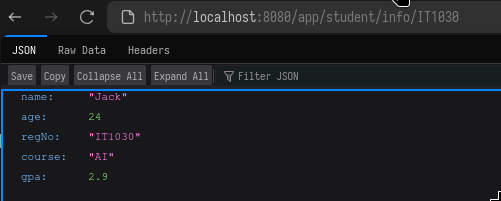

# Day 03 - Path Variables, Models and Data handling

This directory contains excercises completed during Day 03.

### Excercises
1. Use path variables to send data.
2. Create a Student model and make proper constructors, getters and setters.
3. Create CRUD operations for the Students model.

## Getting Started
Clone the Repo and Open project using Spring Tool Suite or other prefered method.
Install the necessary dependencies using maven.
Run the Applicartion.
Visit the localhost:8080 in your browser.

### Routes
Refer the API documentation.

### Outputs
#### app/msg

#### app/name

#### app/name/{id}

#### app/age/{number}

#### app/info/{id}/{name}

#### app/student/studetails

#### app/student/info/{id}

#### app/student/info/all

#### app/student/filter/age/values

#### app/student/sort/gpa

#### app/student/create

#### app/student/update

